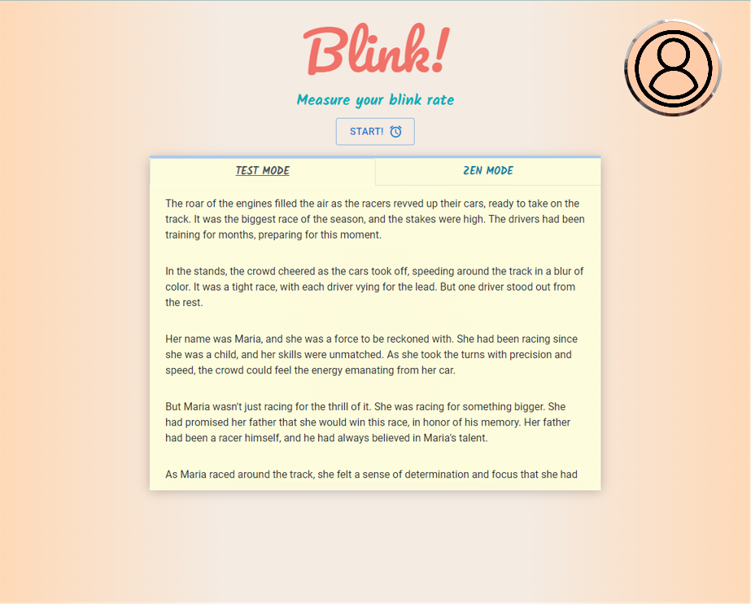
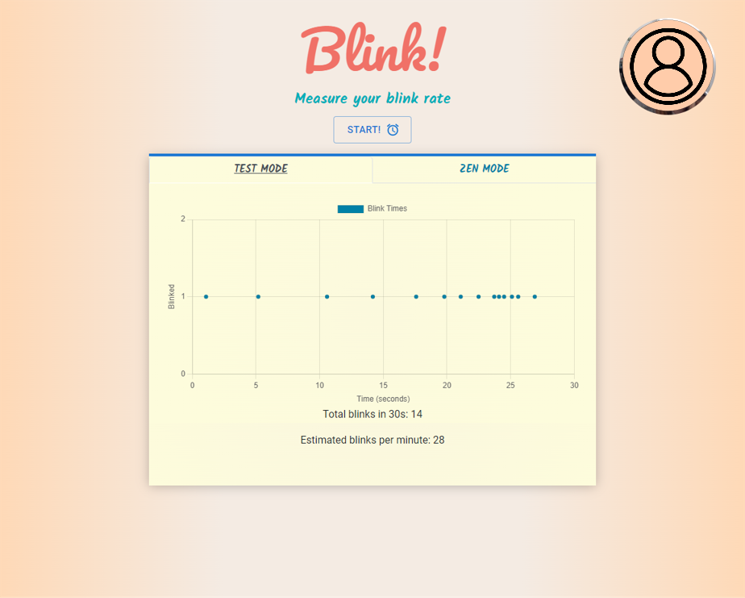
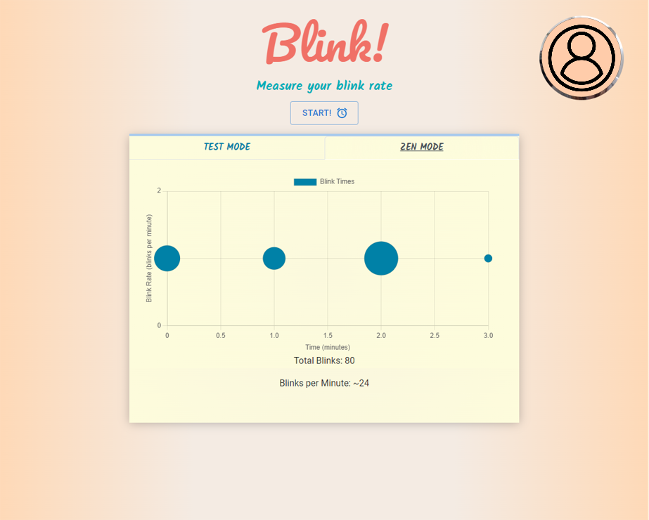

# Blink!

## About the Project

A personal project to measure blink rate during focused reading or task completion.

After granting webcam access, two modes are available to measure blink rate: Test Mode and Zen Mode.

In Test Mode, users are given 30sec to read a short story. Their blinks and blink rate per minute will be measured, and the time of each blink is plotted on a graph displayed at the end of the 30 seconds.

In Zen Mode, users can leave the application open while going about their computer tasks. A bubble graph will display their relative blinks per minute - the more blinks in that minute, the larger the bubble. The total number of blinks alongside blinks per minute will also be displayed at the bottom fo the graph.

## Built With

### Bundled With

## Application

  
  
  

